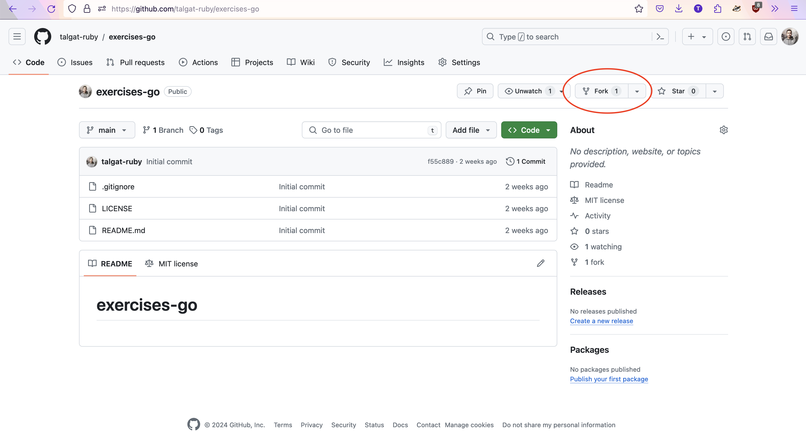

# exercises-go

This is exercises repo.

## Prerequisites

You will need:

- [git](https://git-scm.com/)
- [go](https://go.dev/)

## Start

1. Fork repo.



2. Clone forked repo. Use ssh because you will need to push.

3. Solve problems and test if they are valid.

```shell
go test -v -bench -race ./...
```

## Update

First need setup remote repo for update. You need to do that **once**:

```shell
git remote add upstream git@github.com:talgat-ruby/exercises-go.git
git remote set-url --push upstream DISABLE
```

Now any time you need to update you can do:

```shell
git pull upstream main
```

## Test

In order to run specific exercise (for example `exercise2`):

```shell
go test -v -bench -race ./exercise2/...
```

Or specific problem (for example `exercise3/problem5`):

```shell
go test -v -bench=. -race ./exercise3/problem5/...
```

Skip optional tests:

```shell
SKIPTEST=optional go test -v -bench=. -race ./exercise1/...
```

## PR

create PR from your repo to this one from branch `{firstname}-{lastname}` for example `talgat-saribayev`.
